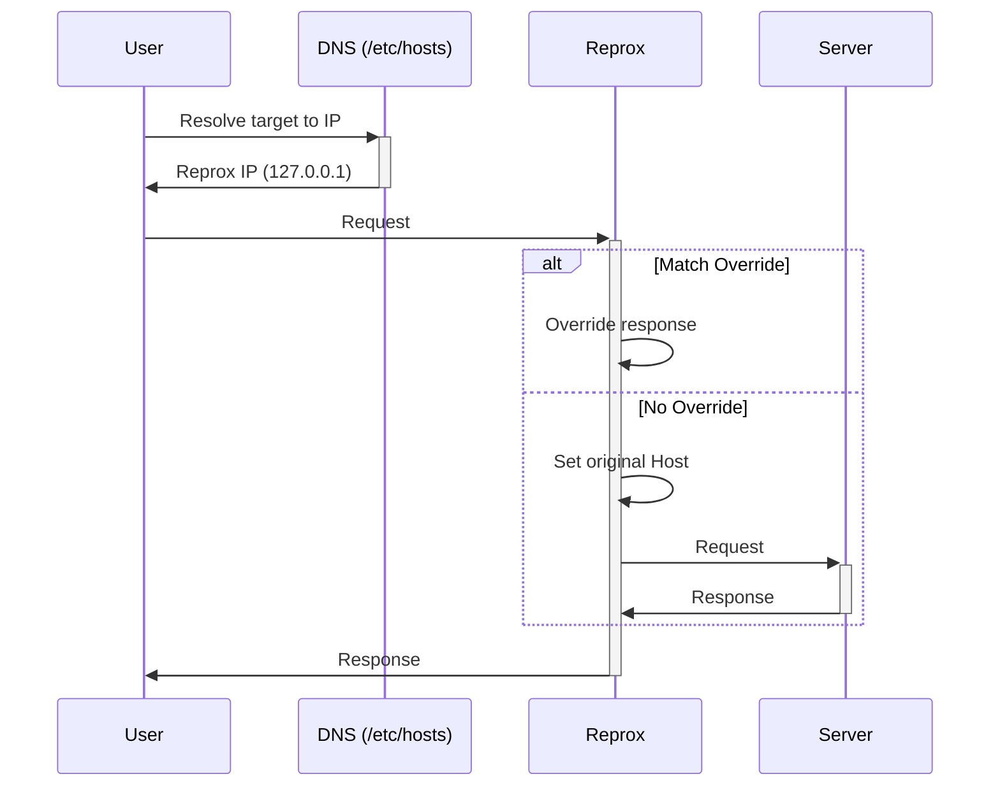

# Reprox

Reprox is a simple tool to proxy and override responses for a specific host. It's useful for things like mocking API responses for local development or testing.



## Usage

```
go build
sudo ./reprox :443 www.linkedin.com 13.107.42.14
```

The example above requires a sudo because it needs to bind to ports 443.

You also need to add the following to your `/etc/hosts` file:

```
127.0.0.1 www.linkedin.com
```

This is because the example above uses a fake SSL certificate for `www.linkedin.com`.
So you can visit https://www.linkedin.com without as usual.
You only need to allow insecure certificates when accessing the site.
Or you can type `badidea` or `thisisunsafe` in the browser to allow insecure certificates.


## Override

Currently, there is no override file format, you have to update the code.
For now there is one sample override in `main.go`, which is for LinkedIn.
You can access this LinkedIn page to verify the proxy works.
```
https://www.linkedin.com/in/candra-kharista/details/skills/
``` 
You must see the override response.

